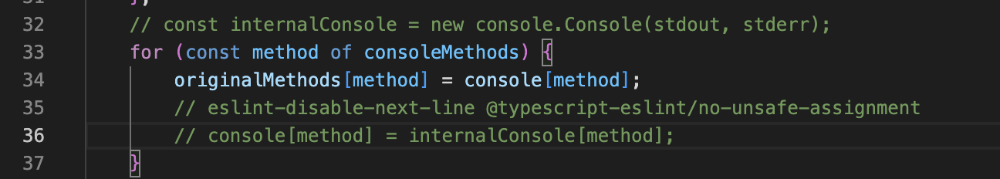

# Year 2015: Throwback powered by Bun
In anticipation for 2015 and a desire to code more, I'm going back to the first year of the advent and doing some puzzles. Also using this as a chance to play with Bun more. 

### CLI App for Puzzle Management
I would like to build a cool CLI app for adding new days, as well as interacting and managing them. Also in effort to learn Bun more and build new/different apps. 

While I try to build the CLI App, I wanted to do this with Ink and React, but there is a problem with running an Ink dependency with Bun, so I had to comment out some code to run the `robot.txs`, helpful to know when I keep working on that if I re-install else where. 
Path to this file is...
`yr2015bun/node_modules/patch-console/dist/index.js`
